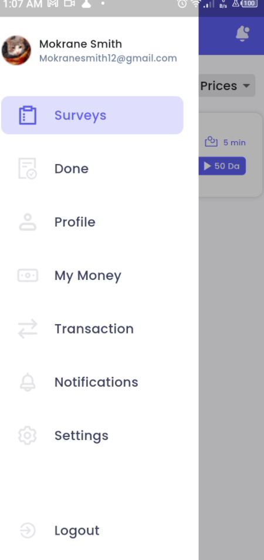

# Coscape Solution Mobile App GuiDiNi

Welcome to the Al-Nachieon App, designed to empower the Algrain local community to support struggling startups while earning rewards for their valuable feedback and data contributions.

# Quick Start
- if you want to check the apk: https://drive.google.com/drive/folders/1bfXNOxaToiFS26jvY6ckvsb1CwZ8QkYg?usp=sharing
- for **contributors**
    - install GetX for state managment

# Pages And Functionality
## Surveys Page
Explore daily surveys presented in an intuitive card format, showcasing potential earnings, estimated completion times, and concise details about each startup.

Upon selecting a survey, a pop-up card appears providing further insights into the startup and its purpose.

## Survey Questions
- Engage with startup pitches, delivered via video or text, and provide feedback through structured questions assessing various aspects of the idea's viability and utility.

Contribute to the community by rating the idea and offering specific feedback for continuous improvement.

## Navigation Drawer
Access multiple navigation options seamlessly to enhance your user experience.

## Done Page: Review previously completed surveys.

## Profile Page: Update profile information and manage payment preferences securely.

## My Money Page: Track recent withdrawals and payments conveniently.

## Transactions Page: Dive into the history of your transactions for transparency.

## Settings Page: Personalize your experience by updating account details and preferences effortlessly.

